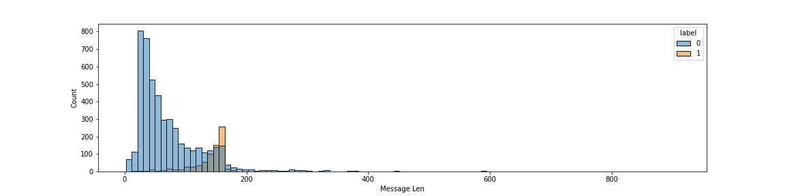

# Project - SMS Spam Detector

## Description
We all know how annoying is to get a lot of Spam messages in our inbox.
This project aims to help identifying those.

## Overview
* Dataset downloaded from [Kaggle](https://www.kaggle.com/uciml/sms-spam-collection-dataset) (aprox 5k sms message).
* Some basics data exploration to get to know the data.
* Created a model with a 96% F1 Score on validation dataset.
* Deployed it using Flask and Heroku.

## Project Timeline

### Exploratory Data Analysis

In this pare I've tried to find some relation between a message characteristic and its label.

This histogram makes it clear that Spam messages tend to be bigger in size when compared to not spam

### Model Building

Did some basic cleaning on the text (removing stop words/ lowering the text) and used CountVectorizer to transform it and train the model

At it is a classification problem and the dataset in imbalanced decided to user F1 Score as metric to calculate the model effectiveness. 

That beein said, four models were tested and it`s results are shown below
* **Linear Regression:** 0.96
* **Decision Tree:** 0.92
* **Random Forest:** 0.93
* **Naive Bayes:** 0.96

After that also tried to improve its performance by oversampling the data but the results weren't any better and decided to stick with the Naive Bayes model.

### Deploying on Heroku

Created a simple flask app and modified some pre-existing html pages to deploy the final model on Heroku.

